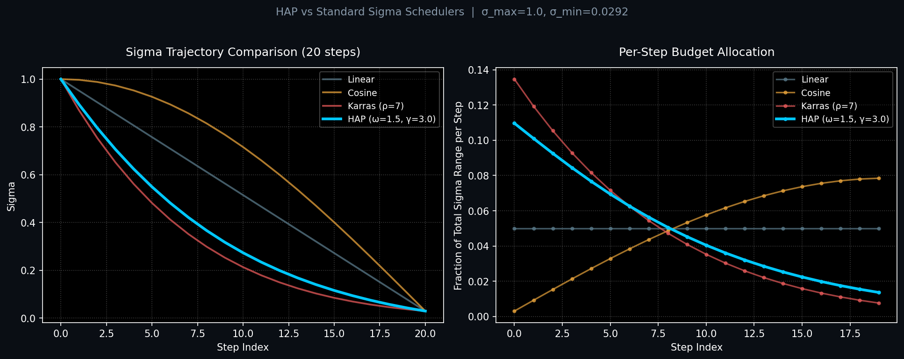

# MD HAP Scheduler
### Hamiltonian Action-Principle Sigma Schedule
**Physics-based sigma scheduler for flow-matching diffusion models.**

*Alexander Allan (MDMAchine) · A&E Concepts · GPL v3*

> **Status:** Public reference implementation. Quantitative benchmarking (FAD, KLD, spectral metrics) is currently underway and will be added to the white paper and this README together once complete.

---

## What Is HAP?

HAP is a physics-derived sigma scheduler for ACE-Step and other flow-matching audio diffusion models. Standard schedulers, cosine, karras, linear, distribute denoising steps uniformly or with fixed mathematical curves. HAP replaces that with a particle-in-potential-well simulation: it models a particle falling through a gravitational well with atmospheric drag, and maps the resulting velocity curve directly to sigma step sizes.

The governing equation is:

```
v(t) = (1 + ω·t) · e^(−γ·t)
```

`ω` (kinetic energy) gives the particle an initial boost, stretching steps in the **mid-sigma zone** where harmonic structure and musical content form. `γ` (damping friction) simulates atmospheric drag, compressing steps toward the **end** where fine grain crystallizes. The result redistributes denoising steps toward the regions of the trajectory that empirically tend to dominate perceptual structure formation, rather than treating all steps as equivalent.

**Validated on:** ACE-Step 2.6B, ACE-Step XL Turbo 4B  
**Deployment:** ComfyUI node · C++ header-only · Lua plugin (HOT-Step)  
**License:** GPL v3 · Commercial dual-license: contact A&E Concepts

---

## Architecture

```
Input: steps, kinetic_energy (ω), damping_friction (γ), σ_max, σ_min
│
├── Safety clamp: steps ≥ 1, σ_max ≥ 0.01
│
├── Simulate time vector: t ∈ [0, 1]  (length = steps)
│
├── Particle velocity: v(t) = (1 + ω·t) · e^(−γ·t)
│   └── clamp(v, ε)  →  time must always move forward
│
├── Integrate: distance = cumsum(v)
│   └── prepend 0  →  exact start position
│
├── Normalize: distance_norm = distance / distance[-1]
│
├── Map to σ space (inverted: σ decreases from max to min)
│   └── σ(i) = σ_min + (σ_max − σ_min) · (1 − distance_norm[i])
│
├── Enforce endpoints: σ[0] = σ_max, σ[-1] = σ_min (or 0.0)
│
└── Output
    ├── sigmas       SIGMAS  (tensor, len = steps + 1)
    ├── visual_curve IMAGE   (matplotlib potential well plot)
    └── analytics    STRING  (runtime log + timing)
```

### Potential Well Mechanics

When `ω = 0, γ = 0`, velocity is constant, identical to linear spacing. As `ω` increases, the velocity peak shifts into the mid-run, stretching the structure zone. As `γ` increases, velocity decays faster, compressing the late-run detail steps into a denser cluster. The two parameters are nearly orthogonal in their effect, making the schedule intuitive to tune.



Left: sigma trajectories overlaid at 20 steps. Right: per-step budget share, HAP front-loads the structure zone while Karras concentrates at both endpoints and cosine sparsifies the middle.

---

## Validated Parameters

### ComfyUI / Python

| Parameter | Default | Range | Notes |
|---|---|---|---|
| `steps` | 20 | 1 to 1000 | Number of denoising steps. |
| `kinetic_energy` ω | 1.5 | 0.0 to 10.0 | Initial velocity boost. Higher = more steps in the structure zone. |
| `damping_friction` γ | 3.0 | 0.0 to 10.0 | Atmospheric drag. Higher = more steps compressed at the detail end. |
| `sigma_max` | 1.0 | 0.1 to 1000.0 | ACE-Step XL default. Top of the potential well. |
| `sigma_min` | 0.0292 | 0.0 to 10.0 | ACE-Step XL default. Bottom of the well. |
| `debug_mode` | 1 - Info | 0/1/2 | 0 = silent, 1 = analytics report, 2 = verbose. |
| `enable_profiling` | False | bool | Per-op timing. Implied enabled at debug ≥ 1. |

**35-step schedule:** `kinetic_energy=2.0`, `damping_friction=2.5`, shallower well curve distributes budget more evenly at higher step counts.

### HOT-Step Lua

| Label | Key | Default |
|---|---|---|
| Kinetic Energy | `kinetic_energy` | 1.5 |
| Damping Friction | `damping_friction` | 3.0 |

> **Note:** The Lua port normalizes to `σ ∈ [0, 1]` and applies a `shift` warp after the well calculation, this is the HOT-Step convention. Absolute σ_max / σ_min are handled by the HOT-Step host. The shape of the schedule is identical to the Python version.

---

## Perceptual Results

| Config | Observation |
|---|---|
| Default (ω=1.5, γ=3.0) | Balanced. Works well across most step counts. Recommended starting point. |
| High γ (γ=5.0-7.0) | Denser detail steps. Sharper final grain, useful at high step counts (35+). |
| High ω (ω=3.0-5.0) | Budget pushed deeper into structure zone. Better harmonic definition at low step counts (15-20). |
| ω=0, γ=0 | Degenerates to linear (all velocities = 1.0). Useful baseline comparison. |

Community finding (scragnog, 2026): HAP combined with multi-pass samplers significantly improves harmonic coherence versus linear or cosine schedules at equivalent step counts. STORM + HAP is the intended combination for the full MD inference stack.

---

## Deployment

### ComfyUI

```
MD_HAP_Scheduler/
├── __init__.py
├── core/
│   ├── __init__.py                ← blank
│   ├── hap_scheduler_core.py
│   └── hap_scheduler_core.hpp
├── hotstep/
│   └── md_hap.lua
└── schedulers/
    ├── __init__.py                ← from .MD_HAPScheduler_Wrapper import *
    └── MD_HAPScheduler_Wrapper.py
```

**`__init__.py` (root):**
```python
from .schedulers.MD_HAPScheduler_Wrapper import NODE_CLASS_MAPPINGS, NODE_DISPLAY_NAME_MAPPINGS
__all__ = ["NODE_CLASS_MAPPINGS", "NODE_DISPLAY_NAME_MAPPINGS"]
```

Drop the folder into `ComfyUI/custom_nodes/`, restart ComfyUI. Node appears as **"MD: HAP Scheduler (Hamiltonian) 🪐"** under `MD_Nodes / Schedulers`.

**Recommended workflow:** `MD HAP Scheduler → STORM Sampler → VAE Decode`

Connect HAP's `sigmas` output to STORM's `sigmas` input. HAP shapes the budget distribution; STORM handles adaptive trajectory correction.

### C++ (acestep.cpp / HOT-Step-CPP)

`hap_scheduler_core.hpp` is a self-contained header-only C++17 implementation. Zero dependencies beyond the STL.

```cpp
#include "hap_scheduler_core.hpp"

auto result = md_hap::calculate_hap_sigmas(
    /*steps=*/   20,
    /*damping=*/ 3.0f,
    /*kinetic=*/ 1.5f,
    /*sig_max=*/ 1.0f,
    /*sig_min=*/ 0.0292f
);

// result.sigmas    → std::vector<float>, size = steps + 1
// result.analytics → std::string log line
```

### Lua ([HOT-Step-CPP](https://github.com/scragnog/HOT-Step-CPP))

Already merged into HOT-Step-CPP master as `md_hap.lua`. To use standalone:

1. Copy `hotstep/md_hap.lua` into your HOT-Step plugins directory.
2. Select **"MD HAP (Hamiltonian Potential Well)"** in the scheduler dropdown.
3. Adjust `Kinetic Energy` and `Damping Friction` sliders.

> **Note:** HOT-Step's `shift` warp is applied after HAP computes the normalized schedule. `shift=1.0` (default) gives pure HAP output. Shift warping does not alter the relative distribution shape, only the absolute σ mapping the host applies.

---

## Files

| File | Description |
|---|---|
| `__init__.py` | ComfyUI node registration |
| `core/hap_scheduler_core.py` | Core math, pure tensor, no ComfyUI deps |
| `core/hap_scheduler_core.hpp` | C++17 header-only port, zero dependencies |
| `hotstep/md_hap.lua` | HOT-Step-CPP Lua plugin |
| `core/__init__.py` | Blank, enables relative imports |
| `schedulers/MD_HAPScheduler_Wrapper.py` | ComfyUI node class + matplotlib visualization |
| `schedulers/__init__.py` | Subfolder wildcard export |
| `pyproject.toml` | Package metadata and dependencies |
| `requirements.txt` | pip fallback |
| `assets/header_animated.svg` | Animated repo header |
| `docs/MD_HAP_Scheduler_White_Paper_v1_1.md` | Technical white paper |

---

## Acknowledgments

- **[scragnog / Captain HOT-Step](https://github.com/scragnog/HOT-Step-CPP)**, HOT-Step-CPP maintainer. Early HAP integration, perceptual validation, and multi-pass pairing testing. Shoutout to scragnog for the fast same-day merges on HOT-Step.

---

## License

**GPL v3**, free for open-source use. See [`LICENSE`](LICENSE).

Commercial closed-source integration requires a dual-license commercial exemption. Contact: A&E Concepts on GitHub.

---

## White Paper

Full technical treatment of the Hamiltonian action-principle scheduler, potential well mechanics, and validated parameter ranges:

[`docs/MD_HAP_Scheduler_White_Paper_v1_1.md`](docs/MD_HAP_Scheduler_White_Paper_v1_1.md)

---

*© 2026 Alexander Allan (MDMAchine) · A&E Concepts · Patent Pending*
